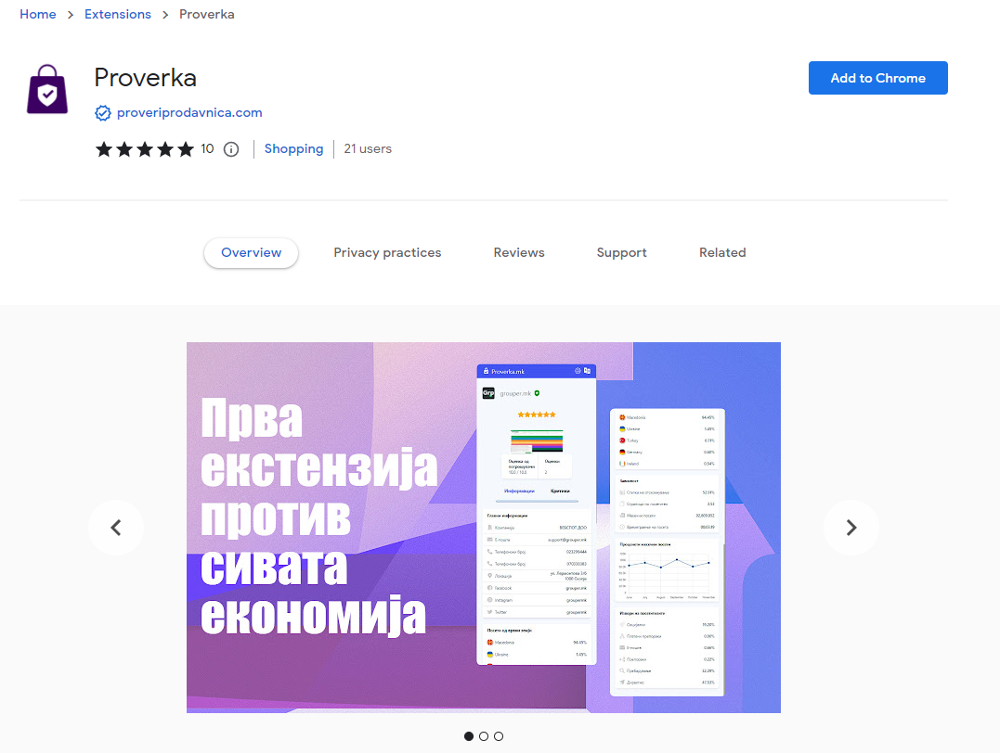

# Proverka Chrome Extension

Proverka is a powerful Chrome extension designed to scrape emails, phone numbers, social media accounts, and more from web pages as digital stores.

## Features

- Extract emails, phone numbers, and social media accounts from websites.
- Customizable scraping options to target specific data.
- Easy-to-use interface for quick data retrieval.

## Installation

1. Clone the repository: `git clone https://github.com/simeonmarkoski/proverka.git`.
2. Open Google Chrome and navigate to `chrome://extensions`.
3. Enable Developer mode (toggle switch usually located in the top right corner).
4. Click on "Load unpacked" and select the cloned repository's folder.

## How to Use

1. Open any web page you want to scrape data from.
2. Click on the Proverka extension icon in your Chrome toolbar.
3. In the extension popup, choose the data types you want to extract (emails, phone numbers, social media accounts, etc.).
4. Optionally, adjust any additional settings to refine your data extraction.
5. Click the "Scrape" button to initiate the scraping process.
6. Wait for the extension to finish scraping the data from the page.
7. The extracted data will be displayed in the extension popup.

## Contributing

We welcome contributions from the community! If you'd like to improve Proverka or report issues, please follow these steps:

1. Fork the repository.
2. Create a new branch: `git checkout -b feature/your-feature-name`.
3. Make your changes and commit them: `git commit -m "Add your feature"`.
4. Push to the branch: `git push origin feature/your-feature-name`.
5. Create a pull request to the `main` branch.

## License

This project is licensed under the [MIT License](LICENSE).

## Disclaimer

Proverka is intended for legal and ethical use only. It is the user's responsibility to comply with all applicable laws and regulations while using this extension.